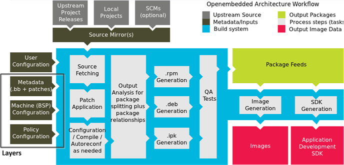

NXP i.MX6 UL Training {-} 
=====================


Contents {-}
--------

#. [Introduction](#introduction)
	1. [Safety notice](#safety-notice)
	1. [Linux tips and tricks](#linux-tips-and-tricks)

#. [i.MX Boot Process]
	1. [Boot introduction]
	1. [Card preparation]
	1. [Partitioning]
	1. [File system creation]

#. [u-boot]
	1. [u-boot introduction](#u-boot-introduction)
	1. [Configuring u-boot](#configuring-u-boot)
	1. [Building u-boot](#building-u-boot)
	1. [u-boot deployment](#u-boot-deployment)

#. [Linux kernel]
	1. [Configuring the kernel]
	1. [Building the kernel]
	1. [Kernel deployment]

#. [Root filesystem]
	1. [Yocto Project introduction]
	1. [Meta layers and recipes]
	1. [Generating the root filesystem]
	1. [Deployment and installing modules]

#. [First boot]
	
#. [Communication interfaces]
	1. [Ethernet]
	1. [USB Gadget]
	1. [I2C: Accelerometer]

#. [Remote debugging]

#. [Running web applications]
	1. [Preparation: accessing the filesystem remotely]
	1. [Sensors]
	1. [Audio streaming]

#. [USB Booting]

#. [Q&amp;A]

#. [Appendix]

# Introduction

Welcome to the NXP i.MX6UL Training hands-on workshop!

The session is expected to take approximately 4 hours.

The user password is 'user', you may be asked to enter it a few times throughout the training. The user has full sudo rights to perform administrative tasks on the system.

## Safety notice

**WARNING:**

When incorrectly using some commands or applications in this training: 

`dd`

`gparted`

Data on your system drive may be permanently erased or made difficult to recover.

Use caution when issuing the above commands, and double check that you specified the correct block device.

In most laptops, Linux will automatically assign `/dev/sda` to the internal drive, and `/dev/sdb` to the optical drive (if present). In this training, however, the internal SATA controller has been disabled by black-listing the ahci driver. As a result, `/dev/sda` should be assigned to the USB drive, and `/dev/sdb` to the USB SD card reader. You can also use the integrated SD card reader in your laptop, which should be identified as `/dev/mmcblk0`.

## Linux tips and tricks

We will be using Linux throughout the entire training, mostly through the command line interface. It is possible to copy and paste commands from this file into the console - use `CTRL` + `SHIFT` + `V` to paste. You can also select text and paste the last selection with the middle mouse button.

The Linux console supports tab expansion. If you start writing a command or file path, press `TAB` once to have the command expanded, or twice to see possible options:

```
$ cd t [TAB]
$ cd training/

$ ls /dev/sda [TAB][TAB]
sda sda1 sda2
```

In Linux, `~` points to the current user's home directory:

```
$ echo ~
/home/user
```

In this tutorial, `$` denotes commands run as a normal user from the development PC, and `#`, commands run as root on the i.MX6UL EVK.

# i.MX Boot Process

## Boot introduction

The boot process begins at Power On Reset (POR) where the hardware reset logic forces the ARM core to begin execution starting from the on-chip Boot ROM.

Based on one-time programmable fuse settings, BOOT_MODE and BOOT_CFG pins, a boot device is selected. The following boot devices are supported:

- NOR Flash
- NAND Flash
- OneNAND Flash
- SD/MMC
- Serial (SPI) NOR Flash and EEPROM
- QuadSPI (QSPI) Flash
- USB/UART Serial Downloader

Boot ROM then initializes the boot device and loads an initial boot region into internal RAM. The region should contain an Image Vector Table structure, which contains data necessary to initialize the DRAM and load the full boot image.

From this point, u-boot performs some peripheral initialization, and loads the kernel and flattened device tree. This process is highly configurable through u-boot environment variables.

It is possible to generate an entire SD card image, including u-boot and the Linux kernel, using Yocto BSP. In this training, however, we will build these components separately from the root filesystem.

Full source code for u-boot and Linux is available at <http://git.freescale.com>.


## Card preparation

In Linux, every block device and character device is represented by a file in `/dev`.
Examples of block devices are disks and partitions, character devices - serial ports and consoles.

In order to identify which `/dev` node corresponds to the USB card reader, issue `dmesg -w` before plugging it into the USB port. When using a USB card reader, you should see something like:

```
[21870.506727]  sdb: sdb1 sdb2
[21870.509486] sd 1:0:0:0: [sdb] Attached SCSI removable disk
```

In the example above, `/dev/sdb` corresponds to the entire SD card, while `/dev/sdb1` and `/dev/sdb2` are the primary partitions.

If using an internal SD card slot of your laptop, you will see `/dev/mmcblk0`, `/dev/mmcblk0p1`, and `/dev/mmcblk0p2`, respectively.

Let us erase a few megabytes of the SD card to remove any old partition table, 
filesystem data and boot settings:

```
$ sudo dd if=/dev/zero of=/dev/sdb bs=1M count=32
```

`dd` is a low-level copy utility. It copies `count` blocks of size `bs` from an input file `if` to an output file `of`.

`/dev/zero` is a special file. All data written to it will be discarded, any
read from `/dev/zero` returns `0x00` bytes.


## Partitioning

We need to create a partition table for the following card layout:

   Start        Size  Partition Filesystem  Label Use
--------  ---------- ---------- ---------- ------ -----------------------
       0         1KB          -                   Partition table and MBR
      1K  end at 4MB          -                   u-boot
      4M        16MB          1 fat16        boot Boot partition
     20M       64MB+          2 ext3       rootfs Root filesystem

You can use gparted (in the menu: System -> Administration -> GParted), fdisk or cfdisk. Keep in mind that fdisk uses 512-byte sectors for addressing.


**Note:** You may need to re-insert the card when using some internal SD readers.

## File system creation

If you used fdisk/cfdisk, you need to create the file systems manually:

```
$ sudo mkfs.fat /dev/sdb1 -n boot
$ sudo mkfs.ext3 /dev/sdb2 -L rootfs
```

# u-boot

## u-boot introduction

Das U-Boot, or Universal Bootloader, is an open-source bootloader that NXP MPU platforms use to load and run the Linux kernel. We support ARM, ARM64 (Layerscape LS2, future i.MX products), and Power Architecture (QoriQ).

The u-boot image includes a boot header, which BootROM uses to determine the load address, load size, and optional boot security.

## Configuring u-boot

u-boot sources are located at `~/training/uboot-imx`.

**Note:** You can see how to download u-boot source code in the [Appendix].

In the default configuration for i.MX6UL EVK, u-boot expects to see the SD card it has booted from in the microSD card holder on the CPU daughter card (SD2). Because we are using the full-size SD slot on the baseboard (SD1), the default configuration has been modified.

A local git branch has been created to implement these changes.

```
$ cd ~/training/uboot-imx
$ git reset --hard ex1
HEAD is now at 9349e3c... Changing boot device from SD2 (microSD on CPU card) to SD1 (SD on base board).
```

```diff
$ git show
commit 9349e3cc42146ef217c94cbbbc4d014edd881961
Author: training <training@example.net>
Date:   Sun Apr 17 02:20:56 2016 +0000

    Changing boot device from SD2 (microSD on CPU card) to SD1 (SD on base board).

diff --git a/include/configs/mx6ul_14x14_evk.h b/include/configs/mx6ul_14x14_evk.h
index edeac03..87d5a1c 100644
--- a/include/configs/mx6ul_14x14_evk.h
+++ b/include/configs/mx6ul_14x14_evk.h
@@ -381,9 +381,9 @@
 #define CONFIG_ENV_SIZE                        CONFIG_ENV_SECT_SIZE
 #endif
 
-#define CONFIG_SYS_MMC_ENV_DEV         1   /* USDHC2 */
+#define CONFIG_SYS_MMC_ENV_DEV         0   /* USDHC1 */
 #define CONFIG_SYS_MMC_ENV_PART                0       /* user area */
-#define CONFIG_MMCROOT                 "/dev/mmcblk1p2"  /* USDHC2 */
+#define CONFIG_MMCROOT                 "/dev/mmcblk0p2"  /* USDHC1 */
 
 #define CONFIG_OF_LIBFDT
 #define CONFIG_CMD_BOOTZ
```

The command `git reset --hard ex1` forces git to point the files to the top of branch `ex1` removing **any** change without a trace. You can also discard changes in one file only (and keep others) by `git checkout <file-name>`. In case you want to keep all changes, you should commit those changes with `git commit -a -m "Add my change"`.

## Building u-boot

A cross-compiler is necessary to build binaries for a different architecture. In this training we use the cross-compiler installed in `/opt/fsl-imx-x11/4.1.15-1.0.0/`:

```
$ source /opt/fsl-imx-x11/4.1.15-1.0.0/environment-setup-cortexa7hf-vfp-neon-poky-linux-gnueabi
```

**Note:** You can see how to create a toolchain using yocto in the [Appendix].

This sets the environment variables for the `make` utility to use the cross-compiler.

A configuration must be selected to build for a specific board:

`$ make mx6ul_14x14_evk_defconfig`

You can see the list of valid configurations in the `configs/` directory.

`$ make -j4 u-boot.imx`

- `u-boot.imx` is the binary, with boot header, to put on the SD card.
- `-j4` means `make` will run at most 4 tasks concurrently, instead of just one.

## u-boot deployment

When partitioning with `fdisk`, we left some space before the first partition. We will now copy `u-boot.imx` directly onto that space:

`$ sudo dd if=u-boot.imx of=/dev/sdb bs=512 seek=2`

Here, we copy `u-boot.imx` onto the SD card, in 512-byte blocks, and we start at block 2 (1 KB offset). This offset is necessary for storing the boot block and partition table of the device.

# Linux kernel

## Configuring the kernel

Linux kernel source tree is located at `~/training/linux-2.6-imx`. 

**Note:** You can see how to download Linux kernel source code on [Appendix]

The repository name is kept for historic reasons, the latest release at the time of writing is 4.1.15.

In one of the following exercises, we will be using the on-board magnetometer (NXP MAG3110) with a userspace driver. In order to avoid conflicts on the I2C bus, the magnetometer has been disabled. We will disable the magnetometer by modifying the Linux Device Tree.

The Device Tree is a data structure for describing hardware. Rather than hard coding every detail of a device into an operating system, many aspect of the hardware can be described in a data structure that is loaded into RAM before kernel starts.

The tree is structured as device nodes, containing properties and child nodes. Properties are simple name-value pairs.

The locally created version `ex1` disables the magnetometer:

```
$ cd ~/training/linux-2.6-imx
$ git reset --hard ex1
HEAD is now at a13a6cd... Disable mag3110 device on i2c1.
```

```diff
$ git show
commit a13a6cdb401b03f7e9479fce89dae13cf18b7942
Author: training <training@example.net>
Date:   Sun Apr 17 15:32:08 2016 +0000

    Disable mag3110 device on i2c1.

diff --git a/arch/arm/boot/dts/imx6ul-14x14-evk.dts b/arch/arm/boot/dts/imx6ul-14x14-evk.dts
index 430da40..5d323d3 100644
--- a/arch/arm/boot/dts/imx6ul-14x14-evk.dts
+++ b/arch/arm/boot/dts/imx6ul-14x14-evk.dts
@@ -231,6 +231,7 @@
                compatible = "fsl,mag3110";
                reg = <0x0e>;
                position = <2>;
+               status = "disabled";
        };
 
        fxls8471@1e {

```

- `status` is a universal property, it can be used to enable or disable any device on the tree. 
- `compatible` identifies the driver to be loaded for the device.

## Building the kernel

As in the u-boot task, we need to have the environment set up to use the cross-toolchain:

```
$ source /opt/fsl-imx-x11/4.1.15-1.0.0/environment-setup-cortexa7hf-vfp-neon-poky-linux-gnueabi
```

Configs are used to define the features (device drivers, subsystems etc.) we want to have in the kernel:

`$ make imx_v7_defconfig`

Note that there is a single kernel config for all i.MX series MPUs based on Cortex-A (i.MX51/53, i.MX6SL/S/DL/D/Q/D+/Q+/SX/UL and i.MX7S/D).

You can access a configuration interface to modify the configuration by issuing:

`$ make menuconfig`

For example, later in the training we will be using the USB Ethernet Gadget driver, which is enabled by *Device Drivers* → *USB support* → *USB Gadget Support* → *Ethernet Gadget (with CDC Ethernet support)*. `<M>` denotes that it will be built as a loadable kernel module, as opposed to being linked into the kernel binary.

Now, build the compressed kernel image, modules and flattened device tree files:

`$ make -j4 zImage modules dtbs`

The modules are now located at various places in the source tree. To place them in a single directory, which can later be deployed:

```
$ rm -R ../linux-2.6-modules/lib
$ INSTALL_MOD_PATH=../linux-2.6-modules/ make modules_install
```

## Kernel deployment

Copy the following files onto the `boot` partition of the SD card:

- `arch/arm/boot/zImage`
- `arch/arm/boot/dts/imx6ul-14x14-evk.dtb`

# Root filesystem

## Yocto Project introduction

The Yocto Project is an open source collaboration project that provides templates, tools and methods to help you create custom Linux-based systems for embedded products regardless of the hardware architecture.

Among other things, the Yocto Project uses a build system based on the OpenEmbedded (OE) project, and the BitBake tool as the task executer and scheduler to construct complete Linux images.



Read more: 

[Yocto Project Reference Manual](http://www.yoctoproject.org/docs/2.0/ref-manual/ref-manual.html#intro-welcome)

[Yocto Project Development Manual](http://www.yoctoproject.org/docs/2.0/dev-manual/dev-manual.html)

## Meta layers and recipes

Files that have the `.bb` suffix are "recipe" files. In general, a recipe contains information about a single piece of software. This information includes the location from which to download the unaltered source, any source patches to be applied to that source (if needed), special configuration options to apply, how to compile the source files, and how to package the compiled output. For image recipes, the recipe defines which packages are to be installed on the target systems, what features are required, how large the filesystem image should be, etc.

Recipes can be extended or overridden by append files (`.bbappend`). Doing so isolates your changes from the main recipe, making them much more manageable and scalable.

Recipes are organized into meta layers which keep the new recipes and changes to existing ones (via `.bbappend`), in one place. Meta layers may be supplied by silicon vendors (e.g. `meta-fsl-arm`) to support a hardware platform, or the community (`meta-openembedded`) for base system and generic software packages, or software providers (`meta-qt5`).

A new layer was created for this training, `meta-training`. It contains one image recipe, called "training-image", and two append files to modify network device configuration and build options for vorbis-tools.

```
meta-training
├── conf/
│   └── layer.conf
├── recipes-bsp/
│   └── images/
│       └── training-image.bb
└── recipes-tweaks/
    ├── init-ifupdown-1.0/
    │   ├── files/
    │   │   └── interfaces
    │   └── init-ifupdown_1.0.bbappend
    └── vorbis-tools/
        └── vorbis-tools_1.4.0.bbappend
```


## Generating the root filesystem

For performance reasons and internet connectivity requirements, the NXP Yocto BSP for i.MX6UL has been pre-installed. Refer to Yocto Project User's Guide inside the documentation package [L4.1.15_1.0.0_LINUX_DOCS](https://www.nxp.com/webapp/Download?colCode=L4.1.15_1.0.0_LINUX_DOCS&location=null&fpsp=1&WT_TYPE=Supporting%20Information&WT_VENDOR=FREESCALE&WT_FILE_FORMAT=gz&WT_ASSET=Documentation&fileExt=.gz&Parent_nodeId=1276810298241720831102&Parent_pageType=product) on [nxp.com](http://nxp.com) for details on host set-up and installation.

Set up BitBake for the i.MX6UL build environment:

```
$ cd ~/training/yocto/
$ source setup-environment build_ul/
```

Build the image:

```
$ bitbake -c clean training-image
$ bitbake training-image
```

Inspect files generated under `build_ul/tmp/deploy/images/imx6ulevk/`.


## Deployment and installing modules

In its default configuration, Yocto creates a full SD card image, which can be flashed onto the card starting at address 0. In this tutorial, we are using u-boot and kernel already copied to SD card on previous sections [u-boot deployment] and [Kernel deployment] , and only the rootfs created by Yocto Project as a `.tar.gz` image.

First, mount the rootfs partition:

`$ sudo mount /dev/sdb2 /mnt/sdcard`

**Note:** Make sure you do not have the device mounted in the file manager.

Extract the file system onto the newly mounted partition:

```
$ cd build_ul/tmp/deploy/images/imx6ulevk/
$ sudo tar -C /mnt/sdcard/ -xvf training-image-imx6ulevk.tar.gz 
```

Copy the modules:


```
$ cd ~/training/linux-2.6-modules/
$ sudo cp -R lib/modules /mnt/sdcard/lib/
```

You can also use the file manager.

Remember to umount the SD card before removing it from the system:

`$ sudo umount /mnt/sdcard`


# First boot

You can now remove the SD card from the reader and insert it into the SD card slot on i.MX6UL EVK.


Connect a microUSB cable to the Power + Console port. Open a serial console on your PC:

`$ sudo picocom -b 115200 /dev/ttyUSB0`

Use `Ctrl` + `a`, `Ctrl` + `x` to exit `picocom`.

After you flip the power switch, you should see the board booting up into Linux. Log in as 'root', no password.

**If, for any reason, your board does not boot up and you would like to continue with the training:**

```
$ cd ~/training/files
$ sudo dd if=sdcard.img of=/dev/sdb bs=1M
```


# Communication interfaces

## Ethernet

Connect your PC to the eth0 port on the EVK, with the Ethernet cable provided. The network connection should already be set up in the system. The IP address of the PC is `192.168.8.1`, and the EVK has address `192.168.8.2`.

You can check connectivity with `ping <ip address>`, or by navigating your browser to <http://192.168.8.2/>.

## USB Gadget

The Linux kernel implements USB gadget drivers, which use the OTG controller in device mode. One of these drivers is g_ether, which implements an Ethernet link over USB. 

Issue the following commands over the serial console:

```
# modprobe g_ether
# ifup usb0
```

Over USB, the PC has address `192.168.7.1`, and the board `192.168.7.2`.

## I2C: Accelerometer

The fxls8471 accelerometer driver exposes a simple file interface in sysfs:

```
# echo 1 > /sys/devices/virtual/misc/FreescaleAccelerometer/enable
# cat /sys/devices/virtual/misc/FreescaleAccelerometer/data
512,-152,-16128
```

## Remote debugging

Before you start debugging, create the directory `/srv/node/` where the debugged binary file will be loaded by default:

`# mkdir /srv/node`

We will use the on-board mag3110 magnetometer to demonstrate how a simple driver can be created in userspace, using Eclipse IDE with the Yocto plug-in to cross-compile and debug an application.

The project has been pre-configured in Eclipse for debugging over the Ethernet interface. In order to debug through the USB link, change the IP address to `192.168.7.2`. Click *Run* → *Debug Configurations...*, then *Edit...* next to the *Connection* field in the *Main* tab.

Once you have the board connected, select *mag3110_gdb_arm-poky-linux-gnueabi* from the drop-down menu, next to the *Debug* bug icon. You can now step through the application, set breakpoints, observe the console output, etc.


Read more about Yocto ADT and using Eclipse with Yocto in the [Yocto Project Application Developer's Guide](http://www.yoctoproject.org/docs/latest/adt-manual/adt-manual.html)

# Running web applications

## Preparation: accessing the filesystem remotely

In addition to the serial console, you can access the target system through ssh:

`$ ssh root@192.168.7.2`

You may need to edit or delete the `~/.ssh/known_hosts` file if you connected to the target, and then re-flashed the card. This is because the public-private key pairs used for authentication are re-created on first boot.

It is also possible to copy files to and from the target:

```
$ scp test.txt root@192.168.7.2:/home/root
$ scp root@192.168.7.2:/home/root/test.txt .
```

You can also use the file manager, Caja, to connect to remote systems over ssh, and browse their files. Go to *File* → *Connect to Server...*, and set up the connection as shown below.


Again, if you wish to use Ethernet, replace `192.168.7.2` with `192.168.8.2`.

Navigate to `/srv/` in the target system, and remove all the files from `/srv/www`. Copy all files from `~/training/mediademo/node/` and `~/training/mediademo/www/` on the PC, to `/srv/node/` and `/srv/www` on the target system.

Change access rights to the files in `/srv/www`:

`# chmod a+r /srv/www/*`

This allows every user in the system (including the http server) to read the files.

While the http server (sthttpd, [Supported](http://opensource.dyc.edu/sthttpd) - [Tiny/Turbo/Throttling HTTP Server](http://www.acme.com/software/thttpd/)) is running on boot, you will need to start the [node.js](http://nodejs.org) applcation server manually:

```
# cd /srv/node
# chmod a+x setup.sh
# ./setup.sh
# node stream.js
```

If you have not finished the [Remote debugging] step, you will also need to copy the `mag3110` executable from `~/training/mag3110/` to `/srv/node` on the target system.

## Sensors 

You can now access accelerometer and magnetometer data through <http://192.168.7.2:8080/imu>.

There is an HTML5 webpage demonstrating accelerometer and magnetometer data in 3D at <http://192.168.7.2/sensors.html>.

## Audio streaming

The same node.js application can be used to stream audio from the on-board microphone with a (browser-enforced) delay of 10s for buffering. The stream is available at <http://192.168.7.2:8080>. 

At <http://192.168.7.2/index.html> there is an HTML5 page with a spectrum analyser for the streamed audio.

The application uses `arecord` to record the PCM audio data, and encodes it with `oggenc` to create an ogg/vorbis stream. Ogg/Vorbis is a free and open alternative to the MP3 format.


# Power saving

i.MX6 BSP supports two suspend states, with configurable wake-up events:

Mode    CPU        DRAM         Peripherals
------- ---------- ------------ ------------
normal  RUN        on           on
standby STOP       self-refresh powered down
mem     power-gate self-refresh powered down

- *standby*, which powers down all peripherals, puts the CPU in STOP mode (but still powered on), and puts the DRAM in self-refresh mode.
- *mem*, which powers down the CPU and all peripherals, and puts the DRAM in self-refresh mode.

First, have the console UART wake up the system:

```
# echo enabled > /sys/bus/platform/drivers/imx-uart/2020000.serial/tty/ttymxc0/power/wakeup
```

To put i.MX6UL in one of the power-save states:

```
# echo mem > /sys/power/state
# echo standby > /sys/power/state
```

# USB Booting

It is possible to boot i.MX6-series processors via the USB OTG interface, with the target board connected to a PC. The USB/Serial Download mode is enabled if `BOOT_MODE[1:0]` pins are set to `01`, or if primary boot device fails.

NXP provides a free, Windows-based tool to automate production programming of Flash memories in an i.MX-based system, called [mfgtool](http://www.nxp.com/download/lgfiles/bsps/L4.1.15_1.0.0_ga-mfg-tools.tar.gz), or *Manufacturing Tool*. There is another tool for Linux, `imx_usb_loader`, available at <https://github.com/boundarydevices/imx_usb_loader>.

`imx_usb_loader` uses `imx_usb.conf` to identify which device configuration file to use with which USB VID:PID pair. Then, the device configuration specifies which files should be loaded into DRAM. See `configs/6ul.conf`

In order to boot i.MX6UL using `imx_usb_loader`, connect both USB cables and issue:

```
$ cd ~/training/imx_usb_loader
$ sudo ./imx_usb
```

# Q&amp;A

&nbsp;

# Appendix

## u-boot

The source repository can be cloned with the following command:

```
$ git clone git://git.freescale.com/imx/uboot-imx.git -b imx_v2015.04_4.1.15_1.0.0_ga
```

## Linux kernel

The source repository can be cloned with the following command:

`$ git clone git://git.freescale.com/imx/linux-2.6-imx.git -b imx_4.1.15_1.0.0_ga` 

## Toolchain

Using the Yocto Project you can build an SDK with the following command line:

```
$ bitbake core-image-base -c populate_sdk
```

The SDK contains the cross-compiling toolchain and all libraries present in the specified system image. Having the libraries makes it possible to build Linux applications fully compatible with the target system.

The SDK has to be installed on the development system, usually somewhere in `/opt`. The installer is located in `<build-dir>tmp/deploy/sdk`. Yocto SDK is used independently from the Yocto BSP installation, and can be used on a different machine.


